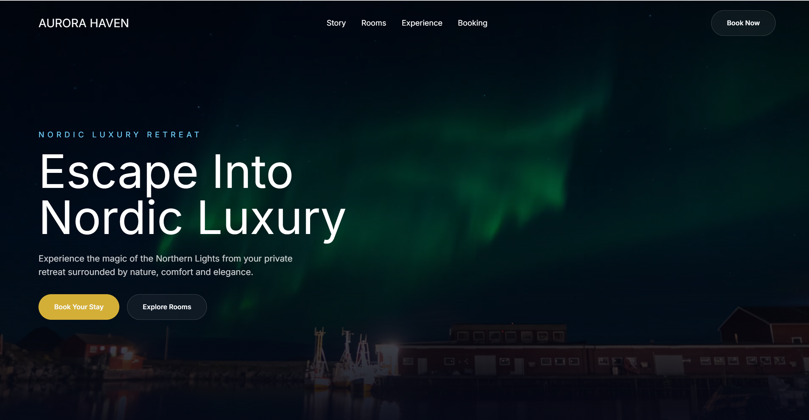

# Aurora Haven – Nordic Luxury Hotel Website

Aurora Haven is a modern luxury hotel website inspired by the beauty of the Nordic landscape and the Northern Lights. The project focuses on creating an elegant digital experience that allows users to explore accommodations and make reservations through a seamless and intuitive booking journey.

## Overview

Aurora Haven is designed to showcase a premium Nordic retreat where visitors can discover unique rooms, explore hotel experiences, and reserve their stay through a user-friendly interface.

The project combines modern frontend development with UX/UI design principles to create an engaging and accessible user experience.

## Features

- Luxury Nordic-inspired design
- Responsive layout for desktop, tablet, and mobile devices
- Interactive room exploration
- Booking and reservation flow
- Smooth page transitions and animations using Framer Motion
- Accessibility-focused design
- Clear navigation and intuitive user journey
- Optimized user experience and visual hierarchy

## UX/UI Focus

This project was developed with a strong emphasis on User Experience (UX) and User Interface (UI) design.

### UX Principles

- Clear and intuitive navigation
- Logical user flow from discovery to booking
- Reduced cognitive load through clean layouts
- Consistent design patterns
- Mobile-first considerations

### Accessibility

- Semantic HTML structure
- Keyboard-friendly navigation
- Readable typography and spacing
- Accessible color contrast
- Responsive design for various screen sizes

## Technologies Used

- Next.js
- React
- TypeScript
- Tailwind CSS
- Framer Motion

## User Journey

1. User lands on the homepage and discovers the Aurora Haven brand.
2. User explores available rooms and accommodations.
3. User learns about the unique Nordic experiences offered.
4. User proceeds to the booking section.
5. User completes a reservation through a streamlined booking flow.

## Project Goals

The primary goal of Aurora Haven was to create a premium hotel website that balances aesthetics, usability, and performance while providing users with a memorable booking experience.

## Future Improvements

- Online payment integration
- Availability calendar
- User accounts and booking management
- Multilingual support
- Advanced filtering for rooms and experiences

## Author

**Farwa Rizvi**

Multimedia Designer & Frontend Developer

Specialized in UX/UI Design, Frontend Development, and creating user-centered digital experiences.
